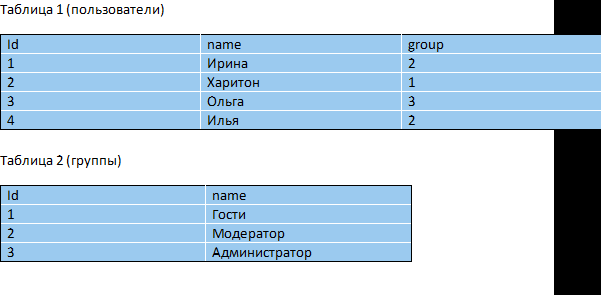
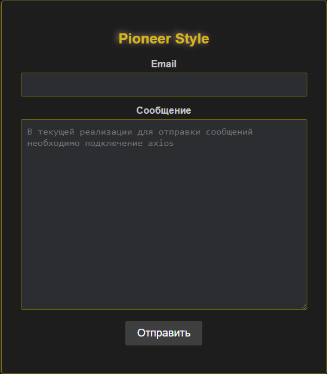

# 1. Задание

Есть таблица Users (тестирование на знание SQL)

Нужно написать один SQL запрос, чтобы получить пользователей из первой группы т.е. пользователей, у которых groupId = 1. 

Результат должен вывести колонки:
- id(пользователя) 
- name(пользователя) 
- name_group (группы)

<small>Подсказка: написать JOIN запрос</small>
<details>
<summary style="cursor: pointer">
Таблица
</summary>


</details>

### Решение
<details>
<summary style="cursor: pointer">
Спойлер

</summary>

```sql
CREATE TABLE `groups` (
  `id` INT NOT NULL AUTO_INCREMENT PRIMARY KEY,
  `name` VARCHAR(255) NOT NULL
) ENGINE=InnoDB DEFAULT CHARSET=utf8mb4 COLLATE=utf8mb4_unicode_ci;

CREATE TABLE `users` (
  `id` INT NOT NULL AUTO_INCREMENT PRIMARY KEY,
  `name` VARCHAR(255) NOT NULL,
  `groupId` INT NOT NULL,
  FOREIGN KEY (`groupId`) REFERENCES `groups`(`id`)
) ENGINE=InnoDB DEFAULT CHARSET=utf8mb4 COLLATE=utf8mb4_unicode_ci;

CREATE INDEX idxUsersGroup ON users (group);
CREATE INDEX idxUroupsId ON groups (id);
```
<small>
Целесообразность индекса для поля name будет определяться тем, 
насколько активно оно используется для поиска или сортировки.
</small>

```sql
select users.id as id, 
       users.name as name, 
       groups.name as groupName
from users
inner join groups 
    on users.groupId = groups.id
where users.groupId = 1
/*order by name*/;
```
</details>

---
# 2. Задание

Выберите правильный вариант А или В. И напишите его преимущество.
<details>
<summary style="cursor: pointer">Вариант А</summary>

```php
<?php
$arItems = [['id' => 1], ['id' => 2], ['id' => 3], ['id' => 4], ['id' => 5]];
foreach($arItems as $key => $arVal) 
{
    $res = CIBlockElement::GetByID($arVal['id']);
    while($arData = $res->GetNext()) 
    {
        $arResult[] = $arData;
    }
}
?>
```
</details>


<details>
<summary style="cursor: pointer">Вариант B</summary>

```php
<?
$arItems = [['id' => 1], ['id' => 2], ['id' => 3], ['id' => 4], ['id' => 5]];
$arIds = [];
foreach($arItems as $arVal)
{
    if(intval($arVal['id']) > 0)
    {
        $arIds[] = intval($arVal['id']);
    }
}
$res = CIBlockElement::GetList( 
    ['ID' => 'ASC'], 
    ['IBLOCK_ID' => XX, 'ID' => $arIds, 'ACTIVE' => 'Y'], 
    false, 
    false, 
    ['ID', 'NAME', 'PREVIEW_PICTURE']
);

while($arData = $res->GetNext())
{
   $arResult[] = $arData;
}
?>
```
[Документация](https://dev.1c-bitrix.ru/api_help/iblock/functions/getiblockelementlist.php)


</details>

### Решение
Вариант B выглядит предпочтительным.  
Этому способствует главным образом всего один запрос к БД,
в то время как Вариант А выполняет отдельный запрос для каждого элемента массива.
Так же в варианте B массив $arItems предварительно отфильтрован и приведён к нужному типу.

---

## 3. Задание

- Написать код компоненты Bitrix без использования стандартных компонент.
- Компонента должна выводить всех пользователей на страницу из группы "Администратор".
- На странице должны отобразиться Логин, Email, Имя, Фамилия.
- Вывод данных должен происходить только в шаблоне компонента.

[Документация](https://dev.1c-bitrix.ru/api_help/main/reference/cuser/getlist.php)

[Документация](https://dev.1c-bitrix.ru/learning/course/index.php?COURSE_ID=43&LESSON_ID=2894&LESSON_PATH=3913.3435.4777.2894)

### Результат
[Bitrix/components/my/admin_list]()

---

## 4. Задание

- Написать код компоненты Bitrix без использования стандартных компонент.
- Компонента должна выводить список товаров из любого раздела на ваш выбор.
- ID раздела необходимо указать через параметры компонента.
- На странице должны отобразиться ID и Название товара.
- Вывод данных должен происходить только в шаблоне компонента.

[Документация](https://dev.1c-bitrix.ru/api_help/iblock/functions/getiblockelementlist.php)

[Документация](https://dev.1c-bitrix.ru/learning/course/index.php?COURSE_ID=43&LESSON_ID=2894&LESSON_PATH=3913.3435.4777.2894)

### Результат
[Bitrix/components/my/product_list]()

---

## 5. Задание
Написать html код формы обратной связи и php код обработчика

- HTML форма должна содержать 2 поля: email и textarea
- PHP должен 
  - принять POST запрос,
  - проверить поля на пустоту, 
  - выполнить валидацию поля email
  - отправить данные на почту.
   
- Задание должно быть выполнено с использованием регулярного выражения.
- Весь код должен быть прокомментирован в стиле PHPDocumentor'а.
- Гуглить можно, но запрещено использовать готовые примеры.


### Результат
<details>
<summary style="cursor: pointer">Структура проекта</summary>

#### [Пример обработки форм обратной связи с использованием PHP](Feedback)
Пример содержит несколько классов для обработки данных формы, полученных разными методами HTTP (GET и POST) и разной логикой валидации.


- [`FormHandlerITF.php`]()

  Интерфейс `FormHandlerITF` определяет статический метод `processForm`, который предполагается реализовать в классах обработчиков форм.


- [`FormHandler.php`]()

  Абстрактный класс `FormHandler` содержит общую логику для обработки форм. Он включает в себя конструктор для инициализации параметров формы, методы для валидации email, отправки сообщения и других операций.


- [`FormHandlerLax.php`]()

  Класс `FormHandlerLax` наследует `FormHandler` и реализует конкретную логику обработки формы с методом GET. Он также включает методы для валидации email и сообщения.


- [`FormHandlerStrict.php`]()

  Класс `FormHandlerStrict` также наследует `FormHandler` и реализует конкретную логику обработки формы с методом POST. Он содержит методы для валидации email и сообщения, а также проверку наличия слова "Пушкин" в сообщении.

<small>
Такая структура позволяет реализовывать новые методы отправки и переопределять методы валидации без необходимости изменения имеющегося кода, что соответствует принципам SOLID.
</small>

- [`feedback.php`]()

  Этот файл использует классы `FormHandlerLax` и `FormHandlerStrict` для обработки формы в зависимости от переданных параметров. Также он содержит комментарии и использует библиотеку [`Symphograph\Bicycle\Api\Response`](https://github.com/symphograph/bicycle/blob/master/src/Api/Response.php) для формирования JSON-ответа.


- [`form.html`]()



</details>

---